# Pinning Sequence

```mermaid
sequenceDiagram
  participant U as User
  participant K as Kernel(s)
  participant A as Adapter (FEG→Drive)
  participant M as AddressMapper
  participant D as GlyphDrive
  participant O as Observer

  U->>K: submit task (via Console)
  K-->>A: finalize { jobId, result, meta }
  A->>M: locate(jobId)
  M-->>A: addr
  A->>D: attachPayload(addr, {result, meta})
  D-->>A: ok
  A->>O: emit pinned { addr, payload }
  O-->>U: show badge + deep link
```

## Flow Description

1. **User submits task** through the console interface
2. **Kernels process** the computation and emit finalize event
3. **Adapter receives** finalize event with jobId, result, and metadata
4. **Address Mapper** converts jobId to torus address
5. **Glyph Drive** stores the payload at the computed address
6. **Observer** receives pinned event and updates UI
7. **User sees** visual feedback and can deep-link to the result
